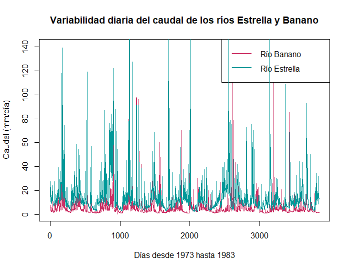
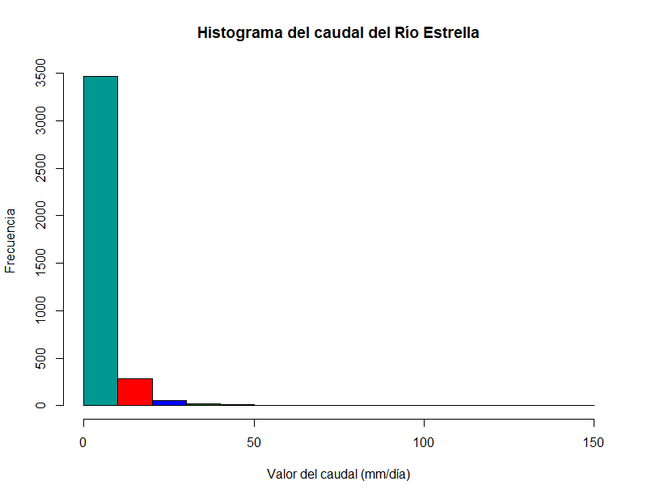
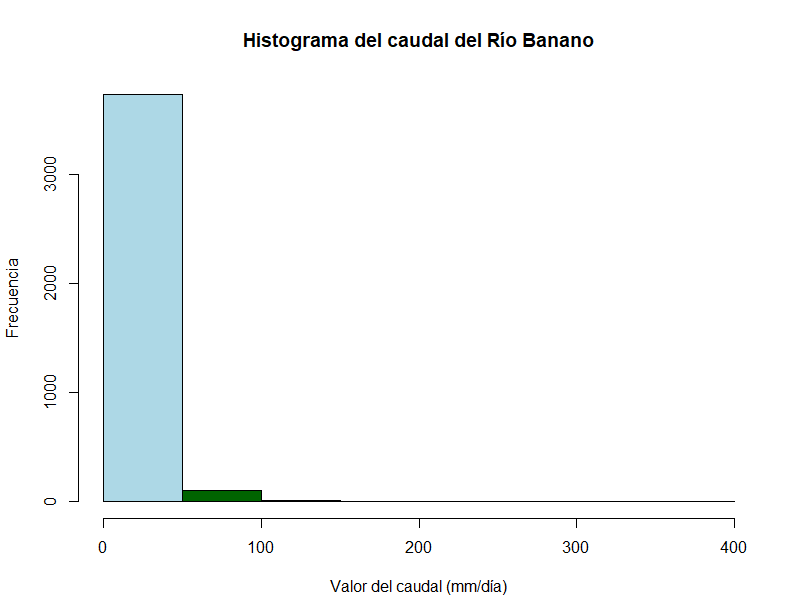
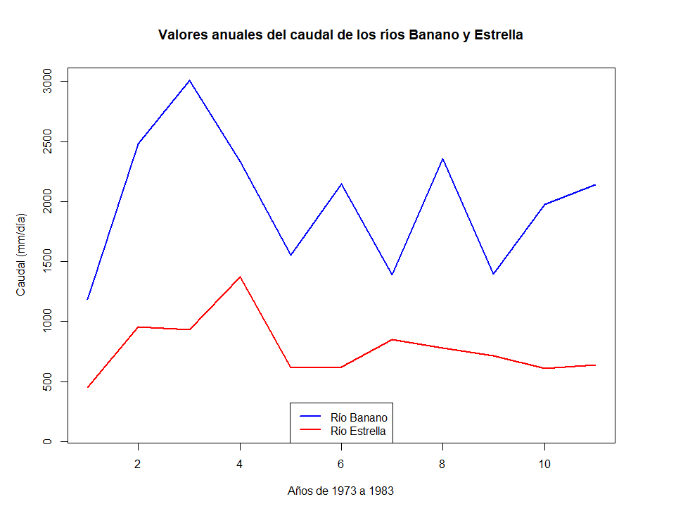
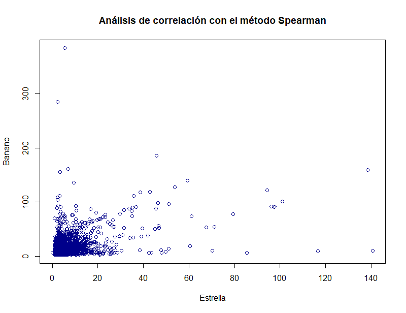
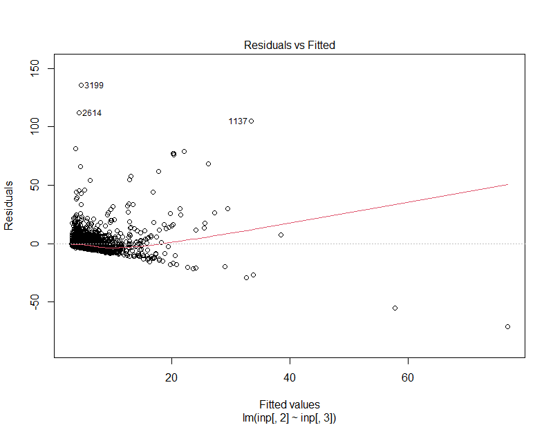
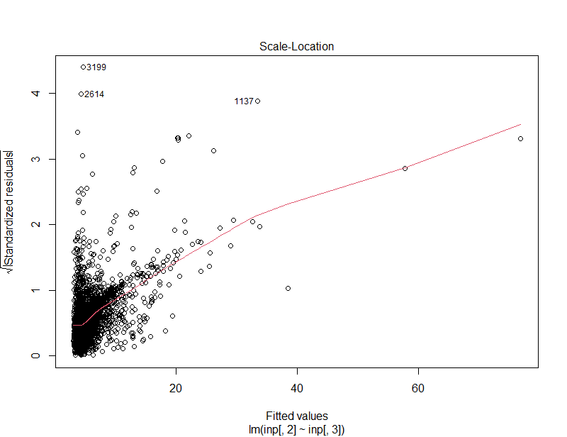
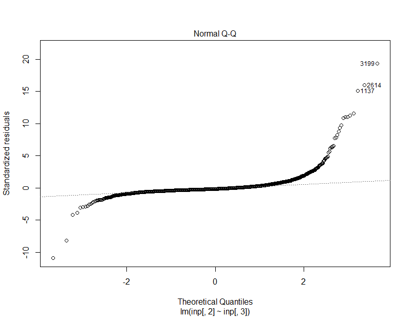
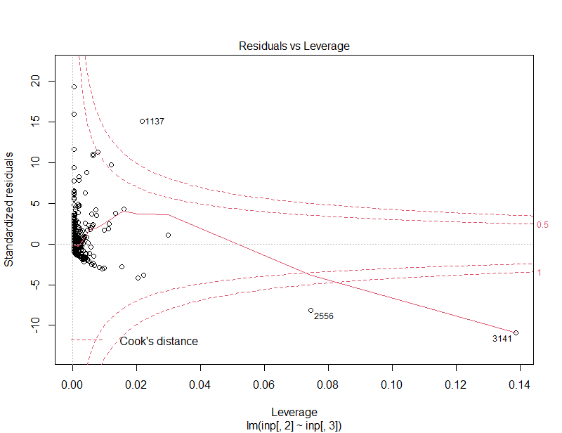

# Exploración de datos geográficos  
### Tarea 2 del curso de Procesamiento de datos geográficos (GF0604)  
_Fecha de entrega: lunes 24 de mayo 2021 hasta las 7:00 a.m._    
Estudiante: Gabriela Becerra Sandoval (C01067) 
  

_En esta práctica se pretenden analizar datos hidrológicos para determinar las relaciones correspondientes al flujo de agua en los ríos Banano y Estrella. En efecto, se estudia el caudal de cada uno de ellos según sus valores anuales, mensuales y la correlación entre cada uno de ellos. El archivo con el que se trabaja muestra las fechas correspondientes a cuanta agua transportó el río Estrella, de la cuenca Pandora, y el río Banano. Entre más alto sea el valor, más mm diarios de agua fluyeron en ese río. A continuación se listarán las etapas que se realizaron para obtener todos los resultados._ 

  
  
  
  
## 1. Agregar y visualizar los datos del archivo FDC.csv
Primero se crea el objeto de asociación `inp` con los datos del la hoja de cálculo. Dentro de los parámetros, agregamos la función `"na.strings"` que nos permite convertir los datos faltantes en un espacio vacío. De este modo, se obtiene una serie de datos continua.  
Luego, con la función `head(inp)` se visualiza el encabezado y las primeras líneas del archivos con los datos de los ríos Banano y Estrella.  
Finalmente, para tener una vista general de cuántas filas y columnas tiene el csv, se llama la función `dim(inp)`.    

    inp <- read.csv("FDC.csv", na.strings = "")    
    head(inp)    
    dim(inp)  
    
 Se obtienen estos resultados:
 
         Tiempo Pandora.mm..637km2. Banano.mm..90km2.
    1 6/22/1973                7.46             21.02
    2 6/23/1973                6.17             14.78
    3 6/24/1973                6.32             27.65
    4 6/25/1973                7.80             19.68
    5 6/26/1973                7.72             15.17
    6 6/27/1973                7.83             23.14
    > dim(inp)

    [1] 3845    3

   
    

## 2. Consultar si los datos son discontinuos
En esta etapa, se convierte todo dato faltante en un `na` para poder tener una serie de datos continuos.  
       
    inp[!complete.cases(inp),] 
       
    #Resultados:
    [1] Tiempo              Pandora.mm..637km2. Banano.mm..90km2.  
    <0 rows> (or 0-length row.names)

  
  

## 3. Graficacación del caudal de los ríos Estrella y Banano
Para poder graficar el historial diario del caudal se llama a la función `plot()`. Se logra un gráfico de la variabilidad de ambos caudales.  
En términos prácticos, se configura el título con `main`, las etiquetas de los ejes con `xlab` y `ylab`, el tipo de gráfico `l` (lineal), y por último los colores para cada línea con `col`. 

     plot(inp[,2], 
          main = "Variabilidad diaria del caudal de los ríos Estrella y Banano", 
          xlab = "Días desde 1973 hasta 1983",  
          ylab = "Caudal (mm/día)",  
          type = "l",   
          col= "#CC3366")  
     legend(x = "topright", 
          inset = c(0, 0),  
          legend = c("Río Banano", "Río Estrella"),   
          lty = c(1, 1),  
          col = c("#CC3366", "#009999"),
          lwd = 2,  
          xpd = TRUE)
     lines(inp[,3], col = "#009999")

El producto final de este gráfico es el siguiente:

 
  

## 4. Promedio de los caudales diarios por 10 años
Primero, se visualizan cálculos estadísticos de los caudales con la función `summary()`
          
    summary(inp[,2:3])
       
    #Resultados:
    Pandora.mm..637km2. Banano.mm..90km2.
    Min.   :  0.180     Min.   :  2.43   
    1st Qu.:  2.390     1st Qu.:  6.88   
    Median :  3.590     Median : 10.18   
    Mean   :  5.459     Mean   : 14.28   
    3rd Qu.:  5.900     3rd Qu.: 15.46   
    Max.   :140.650     Max.   :384.00 

Después, se grafican los historiogramas que muestran esos cálculos:

    hist(inp[,2],
         main = "Histograma del caudal del Río Estrella",
         xlab = "Valor del caudal (mm/día)",
         ylab = "Frecuencia",
         col=c("#009991", "red", "blue", "darkgreen", "magenta"))
    hist(inp[,3],
        main = "Histograma del caudal del Río Banano",
        xlab = "Valor del caudal (mm/día)",
        ylab = "Frecuencia",
        col=c("lightblue", "darkgreen", "red", "green", "magenta"))

  
 

 
  

## 5. Cambio de nombres de las columnas
Se definen las columnas [,1], [,2] [,3] con los nombres "fecha", "Estrella" y "Banano":

    names(inp) <- c("fecha", "Estrella", "Banano")
    attach(inp)

  
  

## 6. Definir el formato de fecha de nuestra serie de datos
Se utiliza la función `strptime` para definir el formato de la fecha de la columna 1 del archivo FDC.csv:

    Tempdate <- strptime(inp[,1], format = "%d/%m/%Y")

   
   

## 7. Calcular el acumulado del volumen anual de agua transportado por los ríos
Se crean los objetos `MAQ_Estrella` y `MAQ_Banano` con el objetivo de calcular el acumulado anual del caudal de los ríos Estrella y Banano. Para poder calcularlo, aplicamos la función `tapply()` que suma todos los valores del caudal para cada año para cada río. Luego, con la función `write.csv` se crea una nuevo archivo separado por comas con esas sumas.

    MAQ_Estrella <- tapply(inp[,2], format(Tempdate, format = "%Y"), FUN = sum)
    MAQ_Banano <- tapply(inp[,3], format(Tempdate, format = "%Y"), FUN = sum)
    write.csv(rbind(MAQ_Estrella, MAQ_Banano), file = "MAQ.csv")

  
  

## 8. Graficar valores anuales
En esta etapa se obtiene un gráfico comparativo de los valores anuales calculados en la etapa anterior. Por lo cual, se tiene que graficar con `plot()` los objetos `MAQ_Banano` y `MAQ_Estrella`. Una de las dificultades de este gráfico es que los valores para el río Banano son más altos que los del río Estrella. Por lo tanto, se emplea `ylim` para ajustar el límite en el eje y, de este modo ambas líneas se visualizan adecuadamente en el gráfico. Por otro lado, se agrega una leyenda con `legend()` y se repite el procedimiento de graficación con `lines()` para el río Estrella. El código fuente es el siguiente:

    windows(width = 20, height = 15)
    opar <- par(no.readonly = TRUE)
    par(mar = c(5, 5, 5, 5))
    plot(MAQ_Banano,
        ylim = c(100, 3000),
        xlab = "Años",
        ylab = "Caudal (mm/día)",
        main = "Valores anuales del caudal de los ríos Banano y Estrella",
        lwd = 2,
        col = "blue",
        type = "l")
    legend(x = "bottom",
        inset = c(0, 0),
        legend = c("Río Banano", "Río Estrella"), 
        lty = c(1, 1),
        col = c("blue", "red"),
        lwd = 2,
         xpd = TRUE) 
    on.exit(par(opar))
    lines(MAQ_Estrella, col = "red", type = "l", lwd = 2)
    
Se obtiene el gráfico siguiente:

  
 

## 9. Graficar variabilidad anual
Primero, se debe calcular el acumulado mensual de los caudales con `tapply()`:

        MMQ_Estrella <- tapply(inp[,2], format(Tempdate, format = "%m"), FUN = sum)
        MMQ_Banano <- tapply(inp[,3], format(Tempdate, format = "%m"), FUN = sum)

   
En un segundo momento, se hace un análisis de correlación con la función `cor()` para las columnas 2 y 3, es decir, del río Estrella y Banano respectivamente. El gráfico se pule agregándole color y título.

        corinp <- cor(inp[,2:3], method = "spearman")
        plot(Estrella, Banano,
          col = "darkblue",
          main = "Análisis de correlación con el método Spearman")
          
 Se obtiene este gráfico:
 

 
Seguidamente, se crea un nuevo objeto `inp.lm` el cual representa la correlación entre el caudal del río Estrella y el del río Banano. Aquí, el valor dependiente es el caudal del río Banano. Asimismo, se llama la función `summary()` para desplegar los cálculos realizados:

       inp.lm <- lm(inp[,2] ~ inp[,3], data = inp)
       
       summary(inp.lm)
       
       
       
       #Resultados en la consola
       [1] Call:
       lm(formula = inp[, 2] ~ inp[, 3], data = inp)

        Residuals:
        Min      1Q  Median      3Q     Max 
        -71.297  -2.267  -1.155   0.774 135.889 

       Coefficients:
                    Estimate Std. Error t value Pr(>|t|)    
       (Intercept)  2.70503    0.15174   17.83   <2e-16 ***
       inp[, 3]     0.19290    0.00707   27.28   <2e-16 ***
       ---
       Signif. codes:  0 ‘***’ 0.001 ‘**’ 0.01 ‘*’ 0.05 ‘.’ 0.1 ‘ ’ 1

       Residual standard error: 7.025 on 3843 degrees of freedom
       Multiple R-squared:  0.1623,	Adjusted R-squared:  0.162 
       F-statistic: 744.4 on 1 and 3843 DF,  p-value: < 2.2e-16
       

Finalmente, se grafican los resultados de los diagnósticos de correlación del método estadístico Spearman de la etapa anterior:
 
       plot(inp.lm)
    
       #En la consola aparece este mensaje:
       <Enter> para ver el próximo gráfico:
       
De este modo se obtienen 4 gráficos:
  
   
  
   
  
   
  

